<picture>
  <source media="(prefers-color-scheme: dark)"  srcset="./logo.svg"/>
  
</picture>

Personal development environment setup for macOS and Ubuntu. One script to bootstrap a fresh machine with tools, configs, and the Catppuccin Mocha theme.

## Quick start

```bash
git clone https://github.com/p-m-p/devenv.git
cd devenv
./install.sh
```

The installer detects your platform and runs the appropriate setup.

### Testing Ubuntu install with Docker

```bash
podman-compose build
podman-compose run ubuntu
```

## What gets installed

### Applications (macOS)

- **iTerm2** - terminal with Catppuccin Mocha theme and auto-profile script
- **Podman Desktop** - container management
- **1Password** - password manager with CLI plugins
- **Google Chrome**

### CLI tools

| Tool | Replaces | Description |
|------|----------|-------------|
| bat | cat | Syntax highlighting, Catppuccin theme |
| eza | ls | Modern listing with icons |
| ripgrep | grep | Fast text search |
| fzf | - | Fuzzy finder |
| zoxide | cd | Learns your directory habits |
| delta | diff | Better git diffs with syntax highlighting |
| jq | - | JSON processor |
| direnv | - | Directory-specific env vars |

### Languages and runtimes

| Tool | Notes |
|------|-------|
| Node.js | Via nvm, with pnpm |
| Go | For vale |
| Rust | For eza, zoxide, selene, stylua |
| Java + Gradle | JDK and build tool |
| Lua | With luarocks |

### Editor

Neovim with my [config](https://github.com/p-m-p/nvim-config). Plugins auto-install on first launch.

### Shell

- **Zsh** with zplug
- **Pure** prompt styled with Catppuccin Mocha
- Plugins: autosuggestions, syntax highlighting, vi-mode, history substring search

### Tmux

- Prefix: `Ctrl-A`
- Vi-mode navigation
- Mouse enabled
- Catppuccin theme with CPU and battery status
- Plugins auto-install via TPM

## Dotfiles

Copied to home directory with backups of existing files:

| File | Purpose |
|------|---------|
| .zshrc | Shell config, aliases, plugins |
| .gitconfig | Git settings and aliases |
| .gitignore | Global ignores |
| .tmux.conf | Tmux config |
| .editorconfig | Editor formatting rules |
| .nvmrc | Node.js LTS version |
| .czrc | Commitizen config |
| .yamllint | Relaxed YAML linting |

## Aliases

```bash
docker → podman
mux    → tmuxinator
pc     → podman-compose
cat    → bat
ls     → eza
ll     → eza -la
tree   → eza --tree
cd     → zoxide
```

## AI coding assistants

I use different AI assistants for work and personal projects.

### Claude Code (macOS - personal)

My personal coding assistant. Installs to `~/.claude/`:

- `settings.json` - tool permissions, extended thinking
- `CLAUDE.md` - project context and conventions
- `mcp.json` - GitHub and Chrome DevTools MCP servers

### Kiro CLI (Ubuntu - work)

Used for work projects. Installs to `~/.kiro/`:

- **steering/** - tech stack docs, coding conventions
- **settings/** - diff tool, LSP configs, MCP servers
- **agents/** - default agent config

## Post-install

1. Restart your terminal
2. Zsh plugins install on first prompt
3. Neovim plugins install on first launch
4. macOS: enable iTerm2 Python runtime for auto-profile script:
   **iTerm2 → Scripts → Manage → Install Python Runtime**
